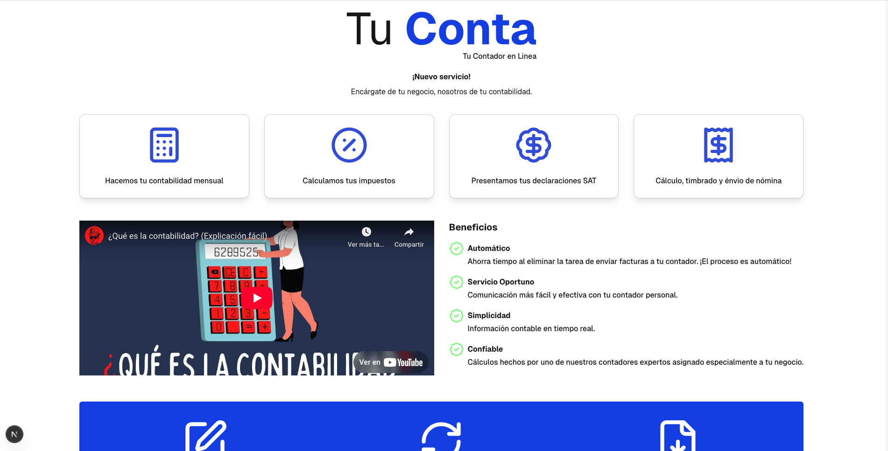
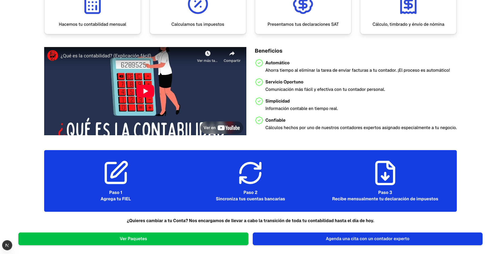
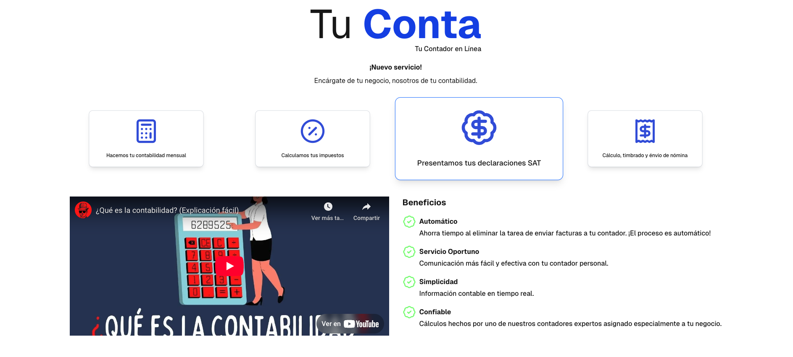
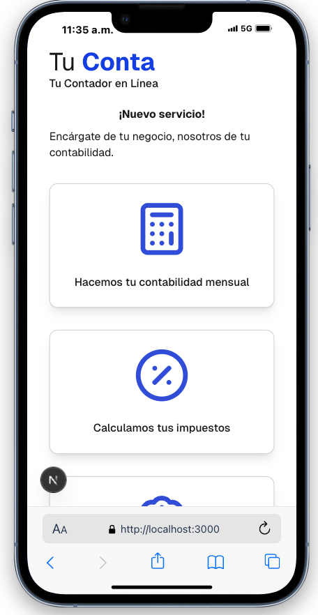
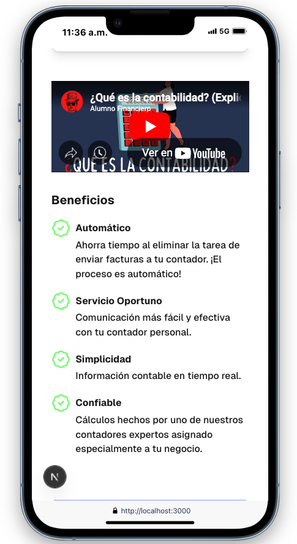
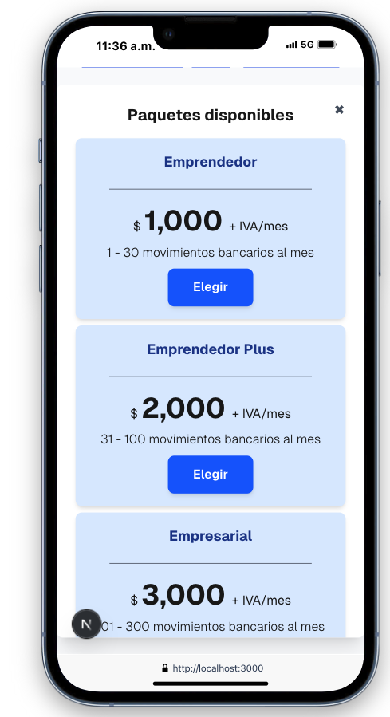
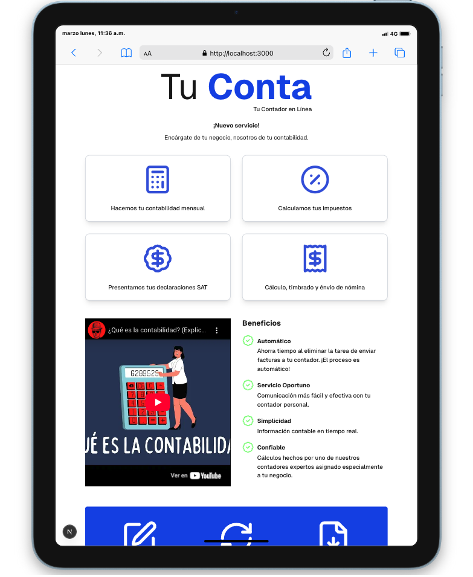
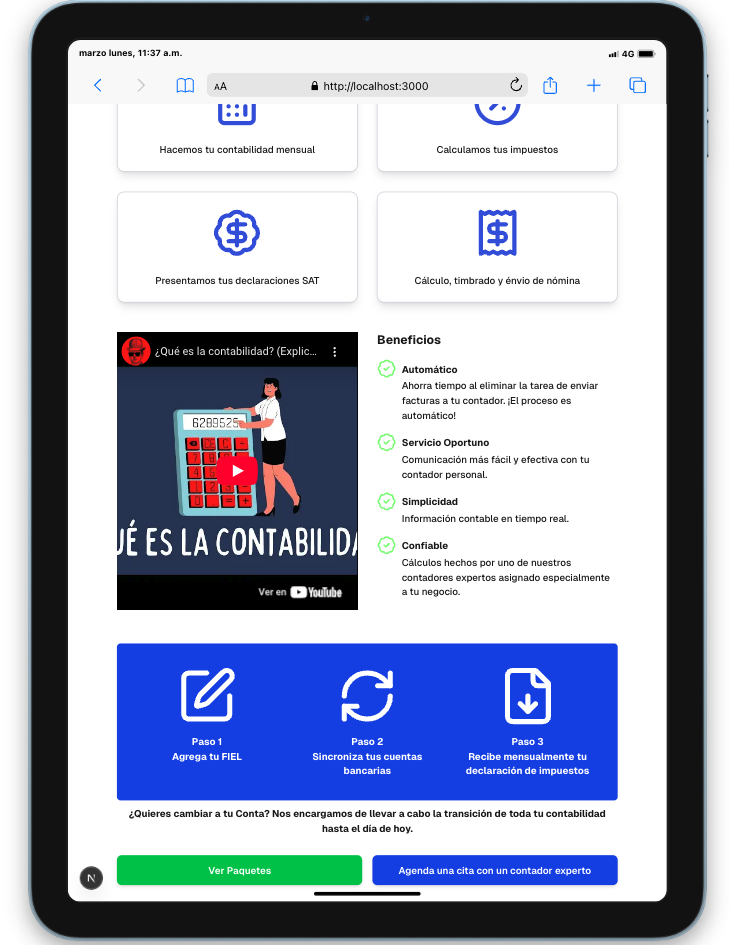
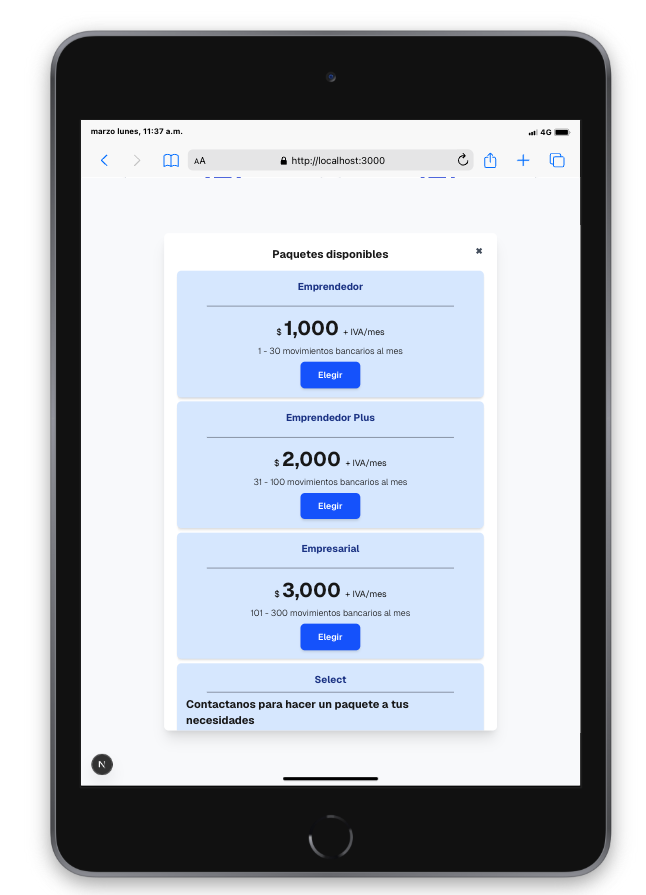

# Doc digitales

## Prueba técnica

A continuación adjunto capturas de imagenes de lo que es la pueba solicitada, de acuerdo al diseñado otorgado.
Así mismo como se ve en difenrentes dispositivos y resoluciones.

La prueba fue realizada con Reac js en espesifico con Nexts Js (v15).

Se siguieron todas las indicaciones proporcionadas.

ENLACE DEL PROYECTO ALOJADO: https://doc-digitales-jade.vercel.app/











## Para ejecutar el proyecto en local los comandos son los siguientes.

```bash
npm run dev
# or
yarn dev
# or
pnpm dev
# or
bun dev
```
